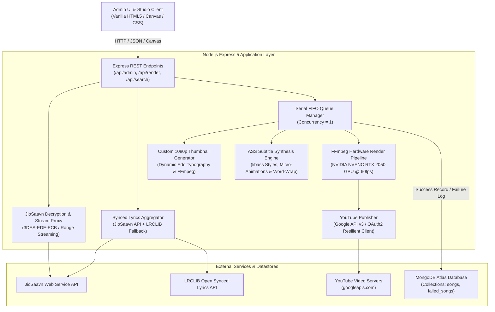
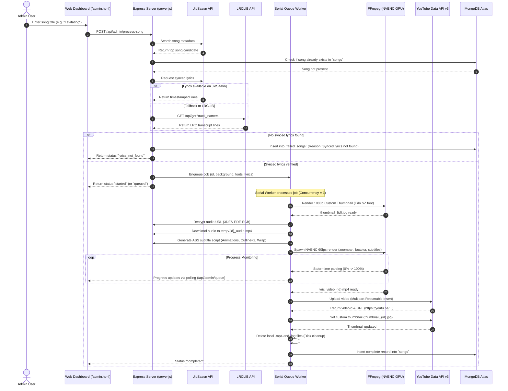

# 🎬 Spark Lyric Video Generator & Automation Studio

Spark Lyric Video Generator is an automated, hardware-accelerated system that searches songs, resolves and decrypts audio streams, verifies synchronized lyrics, generates custom 1080p thumbnails, renders 60fps lyric videos using NVIDIA NVENC GPU acceleration, and publishes them automatically to YouTube with custom thumbnails and timeline descriptions.

---

## 📑 Table of Contents
- [Project Overview](#-project-overview)
- [Directory Structure](#-directory-structure)
- [High Level Design (HLD)](#-high-level-design-hld)
  - [System Architecture](#system-architecture)
  - [Core Components](#core-components)
- [Technology Stack](#-technology-stack)
- [Detailed Data Flow](#-detailed-data-flow)
  - [End-to-End Sequence Diagram](#end-to-end-sequence-diagram)
  - [Pipeline Step-by-Step](#pipeline-step-by-step)
- [Queue & Failure Resilience](#-queue--failure-resilience)
- [Setup & Installation Guide](#-setup--installation-guide)
- [API Reference](#-api-reference)

---

## 🌟 Project Overview

Spark Lyric Studio provides a web-based studio and an automated admin engine:
1. **Interactive Studio (`/index.html`)**: Search any song, preview synchronized lyrics in real time, customize animations, fonts, background images, and export 1080p 60fps lyric videos with 3D spatial audio effects.
2. **Automated Admin Engine (`/admin.html`)**: Batch or single-click automation that searches a song query, validates synchronized lyrics, assigns background artwork and typography, enqueues rendering through a FIFO serial queue worker, uploads the finished video directly to YouTube with custom Edo thumbnails, cleans up local disk space, and logs records to MongoDB Atlas.

---

## 📁 Directory Structure

```text
video-lyrics/
│
├── assets/                          # Static media assets
│   ├── background/                  # 1080p background images (1.png ... 26.png)
│   └── fonts/                       # Embedded TrueType fonts for libass (edosz.ttf)
│
├── credentials/                     # YouTube OAuth 2.0 security store
│   ├── secret.json                  # Google Cloud OAuth 2.0 client secret
│   └── tokens.json                  # Auto-refreshed access and refresh tokens
│
├── ffmpeg/                          # NVIDIA NVENC GPU-accelerated FFmpeg build
│   └── bin/
│       ├── ffmpeg.exe               # 64-bit FFmpeg with NVENC & libass support
│       └── ffprobe.exe              # Stream analyzer
│
├── public/                          # Frontend client web applications
│   ├── index.html                   # Interactive Spark Lyric Studio UI
│   ├── style.css                    # Studio styling, glassmorphism & typography
│   ├── app.js                       # Studio client logic, audio sync & timeline controls
│   ├── admin.html                   # Admin Automation Control Panel
│   ├── admin.css                    # Apple-inspired minimalism design system
│   ├── admin.js                     # Admin logic, live canvas preview, queue polling
│   └── fonts/                       # Web fonts served to the browser (Edo.ttf, etc.)
│
├── output/                          # Storage for generated videos & thumbnails
├── temp/                            # Temporary audio buffers and ASS subtitle scripts
│
├── automation.js                    # Core automation utilities, fonts, thumbnail generator
├── server.js                        # Express 5 server, REST APIs, queue worker, render engine
├── youtube.js                       # Google YouTube Data API v3 OAuth & upload service
├── package.json                     # Node.js project manifest & dependencies
└── .env                             # Environment configuration (MongoDB URI, Port)
```

---

## 🏛 High Level Design (HLD)

### System Architecture

The following diagram illustrates the architecture of Spark Lyric Studio:



### Core Components

1. **Express Application Server (`server.js`)**:
   - Hosts static assets and web endpoints.
   - Manages audio stream proxying with HTTP Range header support for seeking.
   - Implements the video rendering engine and serial queue worker.

2. **JioSaavn Decryption Engine (`server.js`)**:
   - Decrypts encrypted media URLs using Triple-DES (3DES-EDE-ECB) with the static initialization key.
   - Resolves bitrate quality variants (320kbps, 160kbps, 96kbps, 48kbps, 12kbps).

3. **Synced Lyrics Aggregator (`server.js`)**:
   - Resolves timestamped lyric lines (in milliseconds) from JioSaavn native lyrics.
   - Falls back to LRCLIB API (`lrclib.net`) to match synced LRC transcripts if JioSaavn lacks timestamps.

4. **1080p Thumbnail Generator (`automation.js`)**:
   - Measures title and artist strings using font metrics.
   - Computes dynamic font scaling (title: 18–24% canvas height; artist: 7–9% canvas height) and vertical spacing.
   - Renders 1920x1080 JPEG thumbnails using FFmpeg and the Japanese brush font **Edo SZ**.

5. **ASS Subtitle Synthesizer (`server.js`)**:
   - Generates Advanced SubStation Alpha (`.ass`) subtitle files.
   - Implements 11 micro-animations (`pop`, `slide`, `bounce`, `zoom`, `glitch`, `typewriter`, `blur`, `glow`, `flip`, `swing`, `fade`).
   - Applies high-contrast black borders (`Outline=2`) and drop shadows (`Shadow=2`) for legibility across any background.
   - Automatically line-wraps long lines (>40 characters) at natural word boundaries into centered two-line layouts.

6. **FFmpeg NVENC Hardware Render Pipeline (`server.js`)**:
   - Leverages local NVIDIA GeForce RTX 2050 GPU (`h264_nvenc`, preset `p4`, `-cq 20`) for high-speed 60fps encoding.
   - Burns ASS subtitles into video via `libass` with `setpts=PTS-STARTPTS` timestamp normalization.
   - Applies dynamic background zoom (`zoompan`), box blur, darkness overlays, and optional 3D binaural spatial audio filters (`apulsator`, `stereowiden`).
   - Emits real-time progress percentages via standard error parsing.

7. **Serial FIFO Queue Worker (`server.js`)**:
   - Restricts heavy video encoding to a single task at a time (Concurrency = 1).
   - Queues pending songs, updates queue positions in real time, and auto-recovers on errors by storing failure reasons in MongoDB `failed_songs`.

8. **YouTube Data API Publisher (`youtube.js`)**:
   - Authenticates via OAuth 2.0 with offline refresh tokens.
   - Uploads MP4 videos directly using resumable multipart streams.
   - Sets custom high-resolution thumbnails and generates formatted descriptions with clickable timeline timestamps (`[MM:SS - Lyric]`).
   - Removes local `.mp4` and `.jpg` output files once uploaded to preserve local disk space.

9. **MongoDB Atlas Layer (`automation.js`, `server.js`)**:
   - Uses `spark_lyrics` database with DNS-resilient connection pooling.
   - Collections:
     - `songs`: Stores published video records, YouTube IDs, URLs, thumbnail links, and metadata.
     - `failed_songs`: Records songs that failed lyrics verification or encoding, capturing the error reason, step, and timestamp.

---

## 🛠 Technology Stack

| Domain | Technology / Library | Description / Purpose |
| :--- | :--- | :--- |
| **Runtime & Server** | **Node.js (ESM)** | Asynchronous event-driven JavaScript runtime |
| **Web Framework** | **Express 5.x** | Fast, minimalist HTTP server framework |
| **Hardware Video Encoder**| **FFmpeg + NVENC** | NVIDIA NVENC RTX 2050 GPU acceleration (`h264_nvenc`) @ 1080p 60fps |
| **Subtitle Engine** | **libass (ASS v4+)** | High-fidelity vector subtitle renderer supporting transform animations |
| **Cryptography** | **Node Crypto / CryptoJS** | DES-EDE3-ECB decryption of JioSaavn media streams |
| **Audio Processing** | **FFmpeg Audio Filters** | AAC 320kbps encoding, `apulsator`, `stereowiden`, `aecho` spatial audio |
| **Database** | **MongoDB Atlas** | Cloud NoSQL database with connection monitoring and automatic reconnects |
| **Cloud Publishing** | **Google APIs (`googleapis`)**| YouTube Data API v3 OAuth2 automated video and thumbnail upload |
| **Frontend Styling** | **Vanilla CSS3** | Custom Apple-inspired aesthetic, glassmorphism, responsive layout |
| **Interactive Canvas** | **HTML5 2D Canvas** | Live interactive thumbnail composer with bidirectional slider synchronization |
| **Typography** | **Edo SZ (TrueType)** | Hand-drawn brush typeface used across lyric overlays and thumbnails |

---

## 🔄 Detailed Data Flow

### End-to-End Sequence Diagram



### Pipeline Step-by-Step

1. **Discovery & Deduplication**:
   - The query is matched against the JioSaavn database.
   - The unique identifier (`songId`) is checked against MongoDB Atlas collection `songs` to prevent duplicate processing.

2. **Timestamped Lyrics Verification**:
   - The pipeline checks JioSaavn's synced lyric payload.
   - If unavailable, the system queries the LRCLIB API to find LRC timestamps.
   - If neither source contains synced timestamps, the job is immediately logged to MongoDB `failed_songs` and the UI notifies the administrator.

3. **Serial Queue Assignment**:
   - If an encoding task is active, the new song is placed into the in-memory waiting list with an assigned queue position (`#1`, `#2`, etc.).
   - The worker executes one video at a time, protecting GPU VRAM and preventing thread starvation.

4. **1080p Custom Thumbnail Generation**:
   - Computes title and singer bounding boxes using proportional font width estimation.
   - Applies auto-shrinking rules to ensure the song title spans at most 1–2 lines within 90% canvas width.
   - Positions artist name 3–5% below the title.
   - Burns the layout using FFmpeg and Edo SZ typography onto the chosen background.

5. **Audio Decryption & Buffering**:
   - The encrypted media link is decrypted using 3DES-EDE-ECB into a direct CDN URL.
   - Streams are downloaded to `temp/` with HTTP range retry resumption.

6. **ASS Vector Subtitle Synthesis**:
   - Creates an ASS v4+ script configured with PlayRes 1920x1080.
   - Maps animation styles (`pop`, `slide`, `bounce`, `zoom`, `glitch`, `typewriter`, `blur`, `glow`, `flip`, `swing`, `fade`) with proper transform sequencing.
   - Injects a black outline (`Outline=2`) and shadow (`Shadow=2`) ensuring readability against bright skies and complex imagery.
   - Automatically wraps long lines into centered two-line stanzas.

7. **Hardware-Accelerated NVENC Encoding**:
   - FFmpeg compiles the filtergraph:
     - Scales and center-crops the background to 1920x1080.
     - Applies optional box blur and subtle zoom-pan animation.
     - Aligns presentation timestamps with `setpts=PTS-STARTPTS`.
     - Burns subtitles via `subtitles` filter using `assets/fonts/edosz.ttf`.
     - Encodes with `h264_nvenc` preset `p4`, CQ `20` at 60 frames per second.

8. **YouTube Publishing & Cleanup**:
   - Generates an SEO-optimized description containing song credits and timeline markers (`[00:15 - Line text]`).
   - Uploads via Google YouTube API v3 in category `10` (Music) with privacy `public`.
   - Attaches the custom thumbnail to the video.
   - Upon upload confirmation, deletes the local video and thumbnail from `output/` to free local storage.
   - Writes the record into MongoDB Atlas collection `songs`.

---

## 🛡 Queue & Failure Resilience

| Scenario | System Behavior |
| :--- | :--- |
| **Multiple Video Requests** | Videos are enqueued in FIFO order. Only 1 video encodes on the GPU at a time. Remaining videos display their position in the queue. |
| **No Synced Lyrics Found** | Song is not processed; an entry is recorded in MongoDB `failed_songs` with the reason and displayed in the Admin Failed Songs panel. |
| **FFmpeg GPU NVENC Busy/Error** | The pipeline automatically catches NVENC memory allocation errors and falls back to CPU `libx264` encoding. |
| **YouTube Network Interruption** | Node.js utilizes `dns.setDefaultResultOrder("ipv4first")` to prevent IPv6 socket drops on Windows, and logs any upload errors while keeping local media safe. |
| **MongoDB Atlas Connection Flap** | Connection pool automatically detects topology closure and re-establishes connectivity with Google DNS (`8.8.8.8`, `1.1.1.1`). |

---

## 🚀 Setup & Installation Guide

### Prerequisites
- **Node.js**: v18.0.0 or higher
- **NVIDIA GPU**: RTX 2050 or higher (for NVENC hardware encoding; falls back to CPU if not present)
- **MongoDB Atlas**: Free or dedicated cluster URI
- **Google Cloud Console Project**: With YouTube Data API v3 enabled and OAuth 2.0 credentials

### 1. Clone & Install Dependencies
```bash
git clone <repository_url>
cd video-lyrics
npm install
```

### 2. Configure Environment Variables
Create a `.env` file in the root directory:
```env
PORT=3000
MONGO_URI=mongodb+srv://<username>:<password>@<cluster>.mongodb.net/spark_lyrics?retryWrites=true&w=majority
```

### 3. Configure YouTube OAuth Credentials
1. Create OAuth 2.0 Client credentials in Google Cloud Console with redirect URI:
   `http://localhost:3000/oauth2callback`
2. Save the credential JSON file as `credentials/secret.json`:
   ```json
   {
     "web": {
       "client_id": "YOUR_CLIENT_ID.apps.googleusercontent.com",
       "client_secret": "YOUR_CLIENT_SECRET",
       "redirect_uris": ["http://localhost:3000/oauth2callback"]
     }
   }
   ```
3. Start the server and navigate to `http://localhost:3000/admin.html` to connect your YouTube account. Tokens will be automatically stored in `credentials/tokens.json`.

### 4. Start the Application
```bash
npm start
```
- Interactive Studio: `http://localhost:3000/`
- Admin Automation Dashboard: `http://localhost:3000/admin.html`

---

## 🐧 Ubuntu 24.04 & Free-Tier Cloud Server Deployment

The codebase is built with an **adaptive dual-engine architecture**:
- **On Local Windows / RTX 2050 GPU**: Automatically probes and leverages NVIDIA NVENC hardware acceleration (`h264_nvenc`, 60 FPS, NVENC preset `p4`) for ultra-fast rendering.
- **On Ubuntu 24.04 (Free-Tier VPS / CPU)**: Automatically detects headless/CPU environment and configures optimized `libx264` CPU encoding (`veryfast` preset, CRF 23, auto-threads) designed to run within 1-2 vCPU and 1GB RAM limits without crashes or stalls.

### Quick Setup on Ubuntu 24.04 LTS (1 Command)
Run the included automated provisioning script on your remote server:
```bash
chmod +x setup_ubuntu.sh
./setup_ubuntu.sh
```
This script automatically:
1. Installs FFmpeg, libass, fontconfig, and build tools via `apt`.
2. Installs Node.js 20 LTS via NodeSource.
3. Copies and registers `edosz.ttf` with fontconfig (`fc-cache -f`).
4. Creates necessary working directories (`output/`, `temp/`, `credentials/`, `logs/`).
5. Installs production Node dependencies.
6. Probes hardware acceleration and verifies encoder capabilities.

### 24/7 Service with PM2 (Recommended)
```bash
# Install PM2 globally
sudo npm install -g pm2

# Start with production configuration (auto-restart, OOM protection)
pm2 start ecosystem.config.cjs

# Save PM2 state and configure auto-start on boot
pm2 save
pm2 startup
```

### Alternatively: Native Systemd Service
```bash
sudo cp spark-lyrics.service /etc/systemd/system/
sudo systemctl daemon-reload
sudo systemctl enable spark-lyrics
sudo systemctl start spark-lyrics
sudo systemctl status spark-lyrics
```

### Free-Tier Environment Variables (.env)
You can tune CPU operation via `.env` without modifying code:
```env
# Forces CPU or NVENC ("auto" | "nvenc" | "cpu")
VIDEO_ENCODER=auto

# CPU preset for free-tier 1-2 vCPU instances ("veryfast" recommended, "ultrafast" for low burst)
CPU_PRESET=veryfast
CPU_CRF=23
CPU_THREADS=0

# Default FPS on CPU (30 FPS yields 2x faster encoding on free-tier VPS; 60 on NVENC)
DEFAULT_FPS=30
MAX_FPS=60
```

---

## 📡 API Reference

### Studio & Rendering
- `GET /api/search?q={query}&page={page}`: Search songs via JioSaavn API.
- `GET /api/song/:id`: Fetch song details, bitrates, and decrypted stream URL.
- `GET /api/stream?url={cdnUrl}`: Stream audio with range-header support.
- `GET /api/lyrics/:id`: Fetch synchronized lyrics with timestamps.
- `POST /api/render`: Render custom video from Studio options.
- `GET /api/render/status/:jobId`: Get render percentage and progress message.

### Admin Automation & Queue
- `POST /api/admin/process-song`: Add a song to the automated queue.
- `GET /api/admin/queue`: Retrieve snapshot of active encoding job and waiting queue.
- `GET /api/admin/failed-songs`: Fetch list of all failed jobs with error reasons.
- `DELETE /api/admin/failed-songs/:id`: Dismiss an item from the failed songs list.
- `DELETE /api/admin/failed-songs`: Clear all failed song records.
- `POST /api/admin/failed-songs/retry/:id`: Re-enqueue a failed song into the pipeline.
- `GET /api/backgrounds`: List all background images available in `assets/background/`.
- `GET /api/youtube/auth-url`: Generate YouTube OAuth consent URL.
- `GET /api/youtube/status`: Check if YouTube token is active and valid.
- `GET /api/system/status`: Real-time system hardware, active encoder (NVENC vs CPU), CPU cores, and memory usage.

